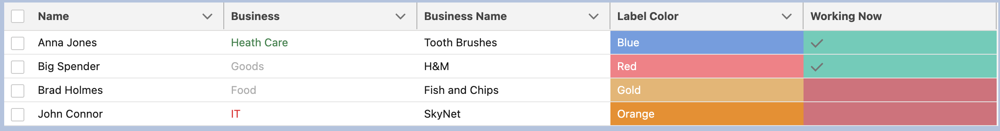

# Salesforce Easy Elements for Working

Personal repository to work with different task, which give ability to work easy on projects.

## Components
1. ["Standard" modal pop-up element](https://github.com/EvgenyVorohobko/Salesforce_Components/tree/main/force-app/main/default/lwc/modal_cmp).
2. [Custom Related List with Role Hierarchy](https://github.com/EvgenyVorohobko/Salesforce_Components/tree/main/force-app/main/default/lwc/relatedList_custom).
    > [!NOTE]
    Dynamically changeable custom Related List. Customers can use the Lightning App Builder for this. Use an example on the Account Record Page with the Opportunity Related List.
    You can see description of each field on [relatedList_custom.js-meta.xml](https://github.com/EvgenyVorohobko/Salesforce_Components/blob/main/force-app/main/default/lwc/relatedList_custom/relatedList_custom.js-meta.xml)

    

    > [!IMPORTANT]
    User works with image like Formula Fields. If you want to replace Formula Fields to image - necessarily add field to Documents object in Salesforce and to separate Field Set.
    Refreshed Related List by Platform Event Refresh_Related_List__e.


    

3. [Reusable Custom Lookup component](https://github.com/EvgenyVorohobko/Salesforce_Components/tree/main/force-app/main/default/lwc/reusableCustomLookup).

4. [Reusable Custom MultiLookup component](https://github.com/EvgenyVorohobko/Salesforce_Components/tree/main/force-app/main/default/lwc/reusableCustomMultyLookup).

5. [Reusable Custom MultiLookup component with SOSL (Search in different fields on object)](https://github.com/EvgenyVorohobko/Salesforce_Components/tree/main/force-app/main/default/lwc/customLookup_multiFields).

6. [Datatable with color of columns](https://github.com/EvgenyVorohobko/Salesforce_Components/tree/main/force-app/main/default/lwc/datatableColor).

    

7. [Example of class that can work with Report and manipulate it](https://github.com/EvgenyVorohobko/Salesforce_Components/blob/main/force-app/main/default/classes/ReportClass.cls).

8. [Example of code that can call Flow]
    1. The following Apex code calls the above Flow and outputs to the Debug log.
        ```
        // Call the Flow
        Map<String, Object> params = new Map<String, Object>();
        Flow.Interview.ReturnHelloWorld helloWorldFlow = new Flow.Interview.ReturnHelloWorld(params);
        helloWorldFlow.start();

        // Obtain the results
        String returnValue = (String) helloWorldFlow.getVariableValue('ReturnValue');
        System.debug('Flow returned ' + returnValue);
        ```
    2. The following code invokes this Flow, by passing the X and Y values in through the Map.
        ```
        // Call the Flow
        Map<String, Object> params = new Map<String, Object>();
        params.put('X', 10);
        params.put('Y', 5);
        Flow.Interview.Calc calcFlow = new Flow.Interview.Calc(params);
        calcFlow.start();

        // Obtain the results
        Double returnValue = (Double) calcFlow.getVariableValue('ReturnValue');
        System.debug('Flow returned ' + returnValue);
        ```
    3. This code constructs a list of Accounts, passes them to the Flow and retrieves the updated list after.
        ```
        // List of records
        List<Account> accounts = new List<Account>{new Account(Name = 'Account A'), new Account(Name = 'Account B')};

        // Call the Flow
        Map<String, Object> params = new Map<String, Object>();
        params.put('Accounts', accounts);
        Flow.Interview.RecordUpdater recordUpdaterFlow = new Flow.Interview.RecordUpdater(params);
        recordUpdaterFlow.start();

        // Obtain results
        List<Account> updatedAccounts = (List<Account>) recordUpdaterFlow.getVariableValue('Accounts');
        for(Account account : updatedAccounts) {
            System.debug(account.Name + ' ' + account.Description);
        }
        ```