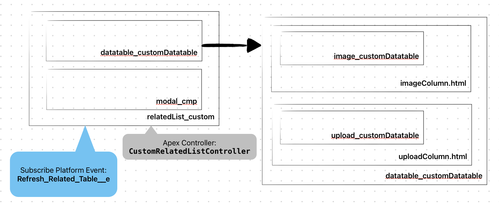

# Salesforce Easy Elements for Working

Personal repository to work with different task, which give ability to work easy on projects.

## Components
1. ["Standard" modal pop-up element](https://github.com/EvgenyVorohobko/Salesforce_Components/tree/main/force-app/main/default/lwc/modal_cmp).
2. [Custom Related List with Role Hierarchy](https://github.com/EvgenyVorohobko/Salesforce_Components/tree/main/force-app/main/default/lwc/relatedList_custom).
    > [!NOTE]
    Dynamically changeable custom Related List. Customers can use the Lightning App Builder for this. Use an example on the Account Record Page with the Opportunity Related List.
    You can see description of each field on [relatedList_custom.js-meta.xml](https://github.com/EvgenyVorohobko/Salesforce_Components/blob/main/force-app/main/default/lwc/relatedList_custom/relatedList_custom.js-meta.xml)

    

    > [!IMPORTANT]
    User works with image like Formula Fields. If you want to replace Formula Fields to image - necessarily add field to Documents object in Salesforce and to separate Field Set.
    Refreshed Related List by Platform Event Refresh_Related_List__e.

    

3. [Reusable Custom Lookup component](https://github.com/EvgenyVorohobko/Salesforce_Components/tree/main/force-app/main/default/lwc/reusableCustomLookup).

4. [Reusable Custom MultiLookup component](https://github.com/EvgenyVorohobko/Salesforce_Components/tree/main/force-app/main/default/lwc/reusableCustomMultyLookup).